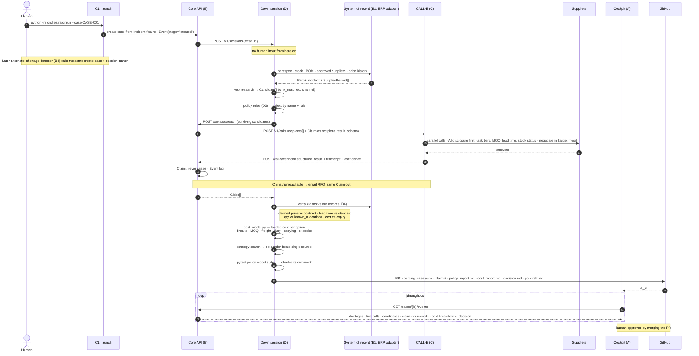

# MVP flow — target sequence

Target end-to-end loop for the Cognition submission (Plan 2). Refine this diagram next so the same flow runs with **mock inputs**: system of record, web research, CALL-E calls, and claims. Live CALL-E and real Devin sessions stay opt-in.

**Trigger (for now):** human over CLI — e.g. `python -m orchestrator.run --case CASE-001`. The shortage detector (B4) is the same handoff later; do not build it first.

Related: [`PLAN.md`](PLAN.md), [`specs/supplyguard-plan-1-foundation-spec.md`](specs/supplyguard-plan-1-foundation-spec.md).

## Input

CLI starts a case from a seeded **Incident** (fixture), not a live ERP write:

| Field | Example role |
| --- | --- |
| `case_id` | `CASE-001` — folder + event log key |
| `part_id` | Part that is short |
| `qty_required` / `qty_on_hand` | Shortfall = required − on hand (floor 0) |
| `line_stop_at` | Deadline (~12 days in the pitch) |
| `line_stop_cost_per_hour`, `expedite_fee`, `currency` | Cost context for later |

## Sequence

## Stage beats

Keep these three visible on stage:

1. A supplier rejected **by name plus the rule**
2. A claim that turns out to be `in_stock_allocated`
3. The **split order** beating every single-source option

## Next (refine here)

- [x] Trigger: human CLI (`orchestrator.run --case CASE-001`); detector later
- [ ] Mark which arrows are mock vs live for the first implementable MVP slice
- [ ] Pull a few slices out of this flow to implement first
- [ ] Devin setup and the tool endpoints Devin calls — after the mock loop walks
