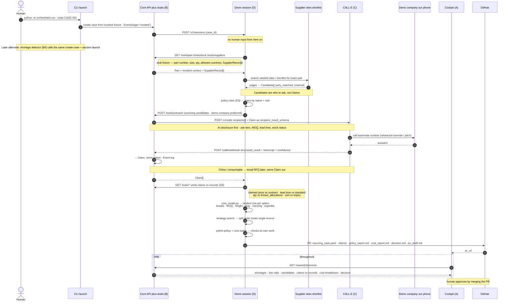
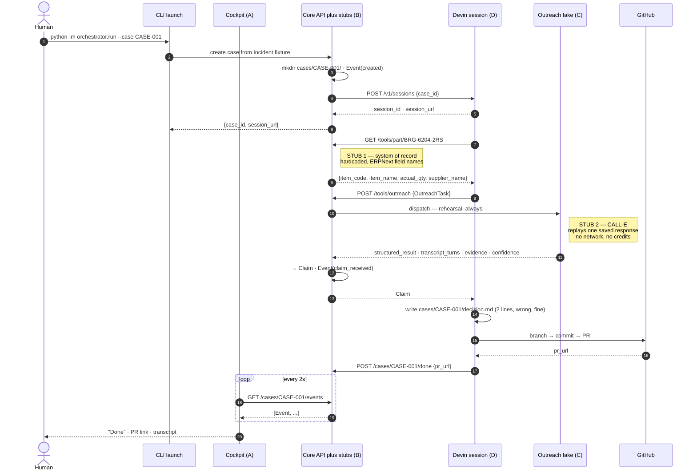

# MVP flow — target sequence

Target end-to-end loop for the Cognition submission (Plan 2), plus the mock-first cut of it that we actually build first. Live CALL-E and the automatic trigger stay opt-in; **real Devin sessions do not** — see [ADR-0004](adr/0004-devin-sessions-are-real-from-the-first-skeleton.md).

**Trigger (for now):** human over CLI — e.g. `python -m orchestrator.run --case CASE-001`. The shortage detector (B4) is the same handoff later; do not build it first.

Related: [`PLAN.md`](PLAN.md), [`../CONTEXT.md`](../CONTEXT.md), [`adr/`](adr/), [`specs/supplyguard-plan-1-foundation-spec.md`](specs/supplyguard-plan-1-foundation-spec.md).

## Input

CLI starts a case from a seeded **Incident** (fixture), not a live ERP write:

| Field | Example role |
| --- | --- |
| `case_id` | `CASE-001` — folder + event log key |
| `part_id` | Part that is short |
| `qty_required` / `qty_on_hand` | Shortfall = required − on hand (floor 0) |
| `line_stop_at` | Deadline (~12 days in the pitch) |
| `line_stop_cost_per_hour`, `expedite_fee`, `currency` | Cost context for later |

## Sequence

## Which arrows are mock, and until when

Three stages. **Nothing moves to the next column until the whole loop is green in the current one.**

| Hop | M0 — mock loop (h3) | M1 — real decision (h8–14) | M2 — stretch |
|---|---|---|---|
| Trigger → session | **CLI**, one command | CLI + button in the cockpit | **detector fires on its own** |
| Devin session | **real** | real | real, possibly fan-out per candidate |
| System of record | mock, 1 hardcoded part | mock, full seed (~40 parts, 15 suppliers) | real `ERPNextAdapter` |
| Web research → candidates | fixture list of 5 | curated real distributors | free web search |
| Policy rules | none | **real, 4 rules** | more rules |
| Outreach dispatch | fake, returns instantly | fake for most + **1 real call** | all real, batched |
| Supplier answers | one saved CALL-E response, replayed | saved + one live | live |
| Webhook | not wired | **real** | real |
| Claim vs record check | none | **real** | real |
| Cost model | none | **real, with price breaks + split search** | tariff/HS refinement |
| Self-check suites | none | **real, gate the PR** | more coverage |
| PR artifacts | 2-line `decision.md` | full artifact set | + PO PDF |
| Cockpit | stage list + PR link, unstyled | all six views, fixture-driven | polish |
| Email / marketplace channel | no | no | yes |

Read the M0 column as the definition of the walking skeleton in [`PLAN.md`](PLAN.md) §11. Read the M1 column as the MVP.

## M0 — the mock loop

This is the first implementable thing and the one on `mvp-stub`. Two stubs, no network anywhere, one command.

The point of M0 is not correctness — every number in it is wrong. It is that **every wire has had a real message pushed through it**, so M1 is four people filling in blanks instead of four people discovering their pieces don't fit.

## What the MVP (M1) contains

**In:**

- One Incident on one Part at one plant, seeded so that the naive answer is wrong.
- Mock system of record behind the two-question adapter, ERPNext-shaped ([ADR-0003](adr/0003-mock-system-of-record-behind-an-adapter.md)).
- ~5 Candidates: curated real distributors, at least one rejected by a named policy rule.
- Four policy rules: blocked origin country, missing required certification, audit required and not audited, lead time after line stop.
- Outreach via CALL-E with `Claim` as the `recipient_result_schema`, rehearsal by default, **one real call in the demo**, at least one supplier answering `in_stock_allocated`.
- Claim-vs-record verification: claimed price against contract, lead time against standard, quantity against known allocations, certification against expiry.
- Landed-cost model with price breaks, MOQ overshoot, freight by weight and mode, duty by origin, carrying cost, expedite surcharge.
- Strategy search that finds a **split order** beating every single-source option.
- Two `pytest` suites — policy and cost — that must be green before the PR opens.
- A PR per Case containing `sourcing_case.yaml`, `candidates.json`, `claims/*.json`, `policy_report.md`, `cost_report.md`, `decision.md`, `po_draft.md`.
- Cockpit: shortage dashboard, case timeline, supplier board, live calls, claim-vs-record comparison, decision view. Fully demoable with the backend off.

**Out, deliberately:** database, auth, in-app approval workflow, email and marketplace channels, real ERPNext, free web search, multiple part classes, PO PDF, purchase execution, an Entire adapter for Devin ([ADR-0007](adr/0007-no-entire-adapter-for-devin-during-the-jam.md)).

## Mock vs later

| Step | Now | Later |
| --- | --- | --- |
| SoR tools | Fixture JSON behind `/tools/*` | SQLite or real adapter, same URLs |
| Web research | Seeded shortlist + optional browse | Richer site list |
| CALL-E | Demo company → our phone / saved claim | Supplier outreach behind the same boundary |

## Stage beats

Keep these three visible on stage:

1. A supplier rejected **by name plus the rule**
2. A claim that turns out to be `in_stock_allocated`
3. The **split order** beating every single-source option

## Open

Settled since this list was written: the trigger is the human CLI above, mock vs live is the table above, and the first slice to implement is M0.

- **Demo scale.** The foundation spec's fixture is a shortfall of 8 units, at which there are no price breaks, no freight trade-off and no split order — the cost model has nothing to compute. Proposal: same 4-supplier fixture shape, scaled to ~40 000 pcs against a 12-day line stop, with price-break tiers per supplier. **Blocks the seed data**, so it needs deciding before B1 starts.
- Whether M2's session fan-out is worth the ACUs. Decide at hour 14, not now.
