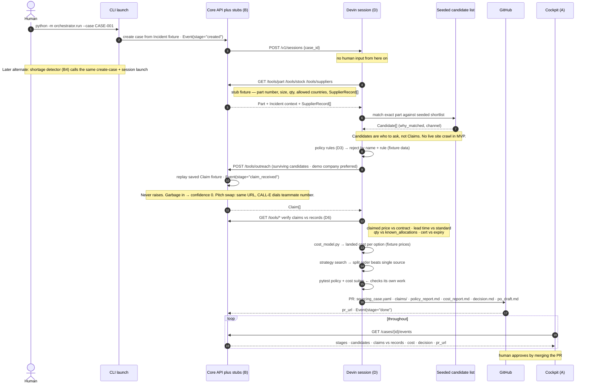

# MVP flow — target sequence

Target end-to-end loop for the Cognition submission (Plan 2). This diagram is the **mock MVP**: fixtures behind tool URLs, a seeded candidate list, a saved Claim from outreach, then real policy/cost/PR logic on that data. Live CALL-E, live web crawl, SQLite, detector, and email RFQ stay out of the happy path.

**Trigger (for now):** human over CLI — e.g. `python -m orchestrator.run --case CASE-001`. The shortage detector (B4) is the same handoff later. Do not build it first.

Devin never talks to SQLite or the system of record directly. It only calls `/tools/...` on the Core API. Those tools return fixture JSON now. Later they can sit on SQLite or a real adapter behind the same URLs.

Slices to implement: [`mvp-slices.md`](mvp-slices.md). Vocabulary: [`../CONTEXT.md`](../CONTEXT.md). Decisions behind this shape: [`adr/`](adr/) — real Devin sessions from the first slice, proposed ([ADR-0004](adr/0004-devin-sessions-are-real-from-the-first-skeleton.md)), the system of record is mocked rather than ERPNext ([ADR-0003](adr/0003-mock-system-of-record-behind-an-adapter.md)), and merging the PR is the approval ([ADR-0005](adr/0005-recommend-not-purchase.md)). Related: [`PLAN.md`](PLAN.md), [`specs/supplyguard-plan-1-foundation-spec.md`](specs/supplyguard-plan-1-foundation-spec.md).

## Input

CLI starts a case from a seeded **Incident** (fixture), not a live ERP write:

| Field | Example role |
| --- | --- |
| `case_id` | `CASE-001` — folder + event log key |
| `part_id` | Part that is short |
| `qty_required` / `qty_on_hand` | Shortfall = required − on hand (floor 0) |
| `line_stop_at` | Deadline (~12 days in the pitch) |
| `line_stop_cost_per_hour`, `expedite_fee`, `currency` | Cost context for later |

## Sequence

## Mock vs later

| Step | MVP (this diagram) | Later |
| --- | --- | --- |
| Trigger | CLI `--case CASE-001` | Shortage detector (B4) |
| SoR tools | Fixture JSON behind `/tools/*` | SQLite or real adapter, same URLs |
| Candidates | Seeded shortlist file | Live browse of supplier sites |
| Outreach | Saved Claim fixture on `POST /tools/outreach` | CALL-E to teammate phone, same Claim shape |
| Verify / cost / policy | Real functions on fixture data | Same, richer seed |
| PR | Real GitHub PR with case artifacts | Unchanged |
| UI | Reads event log (can be ugly) | Full cockpit polish |
| Out of path | — | Email RFQ, China channel, detector, live distributor calls |

## Stage beats

Keep these three visible. Seed the fixtures so they happen:

1. A supplier rejected **by name plus the rule**
2. A claim that turns out to be `in_stock_allocated`
3. The **split order** beating every single-source option

## Next

- [x] Trigger: human CLI. Detector later
- [x] Mock vs live arrows for the MVP path
- [x] Tail: rehearsal Claim, no email RFQ, no live crawl, UI reads events only
- [x] Five implementation slices: [`mvp-slices.md`](mvp-slices.md)
- [ ] Devin setup detail when you implement the launch slice
- [ ] **Demo scale — blocks the seed data.** The foundation spec's fixture is a shortfall of 8 units, at which there are no price breaks, no freight trade-off and no split order, so the cost model in slice 5 has nothing to compute and stage beat 3 cannot happen. Proposal: same 4-supplier fixture shape scaled to ~40 000 pcs against the 12-day line stop, with price-break tiers per supplier. Settle before slice 2 seeds fixtures.
