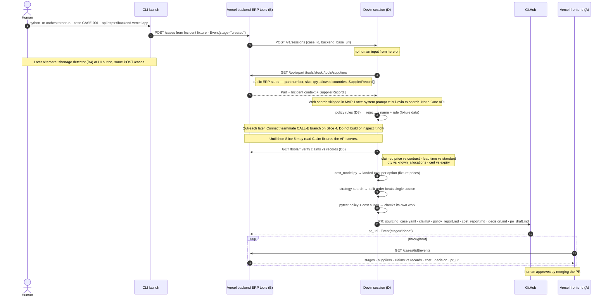

# MVP flow — target sequence

Target end-to-end loop for the Cognition submission (Plan 2). This diagram is the **mock MVP**: fixtures behind tool URLs, then policy/cost/PR logic on that data.

**Not in the MVP path:** live web search, email RFQ, shortage detector, SQLite, China channel. **Outreach** is already on the teammate CALL-E branch. Do not implement or inspect it now. Wire it when that slice is next.

**Trigger (for now):** human over CLI against the deployed backend — e.g. `python -m orchestrator.run --case CASE-001 --api https://<backend>.vercel.app`.

**Deploy:** frontend and backend on **Vercel**. They talk over HTTPS. Devin also calls that public backend. ERP access is HTTP on the backend (`/tools/part`, `/tools/stock`, `/tools/suppliers`, and later more). Devin never talks to SQLite or an ERP directly.

Those tools return fixture JSON now. Later they can sit on SQLite or a real adapter behind the same URLs. Serverless has no durable local disk. Serve fixtures from the repo. Put case events in something the API can read across requests (JSON in-repo, KV, or files Devin commits).

Web search is skipped. If we add it later, it is Devin following the system prompt, not a Core API feature.

Slices to implement: [`mvp-slices.md`](mvp-slices.md). Related: [`PLAN.md`](PLAN.md), [`specs/supplyguard-plan-1-foundation-spec.md`](specs/supplyguard-plan-1-foundation-spec.md).

## Input

CLI starts a case from a seeded **Incident** (fixture), not a live ERP write:

| Field | Example role |
| --- | --- |
| `case_id` | `CASE-001` — folder + event log key |
| `part_id` | Part that is short |
| `qty_required` / `qty_on_hand` | Shortfall = required − on hand (floor 0) |
| `line_stop_at` | Deadline (~12 days in the pitch) |
| `line_stop_cost_per_hour`, `expedite_fee`, `currency` | Cost context for later |

## Sequence

## Mock vs later

| Step | MVP (this diagram) | Later |
| --- | --- | --- |
| Host | Frontend + backend on Vercel. Public HTTPS | Unchanged |
| Trigger | CLI `--case CASE-001` against the Vercel API | Shortage detector (B4) or UI button |
| ERP / SoR | Public `/tools/part`, `/stock`, `/suppliers` on the backend | SQLite or real adapter, same URLs |
| Web search | Skipped | System prompt. Devin searches. Not a Core API |
| Outreach | Skip for now | Wire existing CALL-E branch (Slice 4). Do not inspect until then |
| Claims until Slice 4 | Fixture JSON the API serves | Real Claims from CALL-E |
| Verify / cost / policy | Real functions on fixture data | Same, richer seed |
| PR | Real GitHub PR with case artifacts | Unchanged |
| UI | Reads event log (can be ugly) | Full cockpit polish |
| Out of path | — | Email RFQ, China channel, detector, live distributor calls |

## Stage beats

Keep these three visible. Seed the fixtures so they happen:

1. A supplier rejected **by name plus the rule**
2. A claim that turns out to be `in_stock_allocated`
3. The **split order** beating every single-source option

## Next

- [x] Trigger: human CLI. Detector later
- [x] Mock vs live arrows for the MVP path
- [x] No email RFQ. No web-search slice. Outreach deferred to teammate CALL-E branch
- [x] Implementation slices: [`mvp-slices.md`](mvp-slices.md)
- [x] Vercel host. Devin and UI call public backend. ERP is `/tools/*`
- [ ] Devin setup detail when you implement the launch slice
