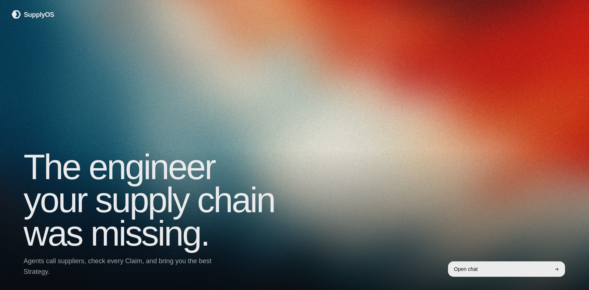
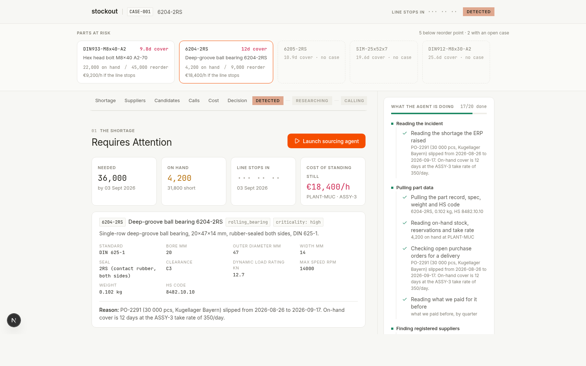

<!-- _class: lead -->



<!--
Speaker, 0:30. The slide is the product. Do not read it out.

A bearing in a bin at PLANT-MUC runs out in twelve days. The line it feeds costs
eighteen thousand four hundred euros an hour when it stands still. Somebody has
to fix that today, and that somebody has a phone and a spreadsheet.
-->

---

## What a shortage costs

### Time
Days of phone tag for one part, and the line keeps counting down at €18,400 an
hour.

### Quality of the decision
A buyer calls the two or three suppliers they already know. Fifteen suppliers
weighed against MOQ, Incoterms, freight, duty and carrying cost is more than
anybody can hold in their head under pressure.

### Money
So you pay for air freight on the whole order, or you let the line stop. The
cheaper answer usually sits between those two, and nobody has time to find it.

<!--
Speaker, 0:45. This is the centre of the pitch. Slow down on the third point:
the money is lost in the option nobody had time to compute.
-->

---

## The plan nobody computes by hand

```yaml
candidates:
  - skf_germany:    compliance: PASS
  - fag_italy:      compliance: PASS
  - ntn_china:      compliance: FAIL (blocked_origin)
  - generic_turkey: compliance: FAIL (missing_cert)

recommended:
  split:
    - air 20% from SKF   # covers the line stop
    - sea 80% from FAG   # unit economy
```

<span class="sub">Fly the fifth that saves the line. Ship the rest.</span>

<!--
Speaker, 15s inside the problem beat. Everybody sees two options: all air, or
stop the line. The third one is arithmetic across every supplier and every
freight mode, which is what a computer is for.
-->

---

## One agent works the whole case

| | |
|---|---|
| **Reads** | the system of record: bin, take rate, the BOM line that stops, the incumbent, the slipped PO |
| **Screens** | every supplier against the company's own compliance rules, rejected by name and by the rule that failed |
| **Calls** | them through CALL-E, asking for MOQ, Incoterms, lead time and price breaks |
| **Costs** | every single-source and split plan, landed, on time first and cheapest second |
| **Ships** | the decision as a pull request |

<!--
Speaker, 0:30. Five verbs, one breath each. Save the architecture for the
question round.
-->

---

<!-- _class: demo -->

## Watch it work

<!-- Placeholder still. Replace with the recorded walkthrough: embedded video if
     ehl.gg takes PPTX, a frame from the recording if it takes PDF. -->



<span class="note">The phone that rings in this room is the same agent.</span>

<!--
Speaker, 1:45, the biggest block in the pitch.

Recording, about 90 seconds, narrated live over muted audio:
  inventory, Source this part, the shortage read out of the ERP, six suppliers
  screened, plans ranked on time first and cheapest second, the pull request.

Then the live call, about 20 seconds. Dial SUP-KBY and let the room hear the
agent say it is an AI and ask its questions. Answer as the supplier, keep it
short, hang up. Do not wait for the re-price: CALL-E needed about 18 minutes in
rehearsal, and the re-priced plan is already in the recording.
-->

---

## Where this goes

# One AI for your whole supply chain.

<span class="sub">End to end, inside the ERP your buyers already work in.</span>

Shortages come first because they hurt most and prove the loop. Reorder points,
supplier discovery, price negotiation and risk across the bill of materials run
on the same machinery.

<!--
Speaker, 0:25. Say it as a roadmap, not a dream: same loop, more workflows.
-->

---

## How we get there

### Start narrow, and in person
A handful of Munich manufacturers. One part family at a time, in the plant, with
their own compliance rules.

### Then compound
Every case adds suppliers, quotes, call scripts and rules that the next customer
inherits. The tenth plant costs less to serve than the first.

<span class="note">We can stand on the shop floor the afternoon a line is at
risk, which is why we start here.</span>

<!--
Speaker, 0:30. The jury wants to know why you and why now. Being able to drive
to the plant beats a market-size slide.
-->

---

<!-- _class: lead -->

# Give your supply chain<br/>**an engineer.**

<span class="sub">SupplyOS · EHL Game Jam Munich · Cognition "Devin for X"</span>

<!--
Speaker, 0:25. Close with the ask: a pilot plant, an introduction to a buying
desk, whatever you want from the room. Fill this in before submitting.
-->
